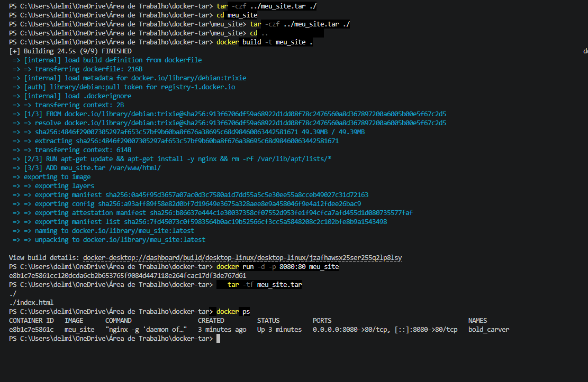
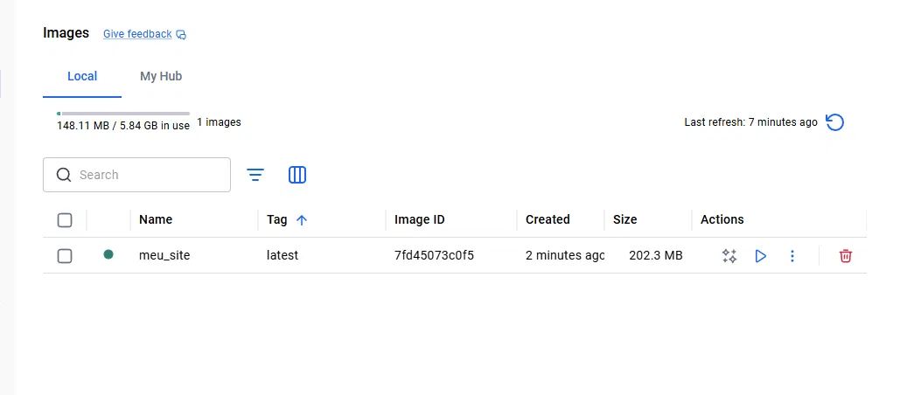
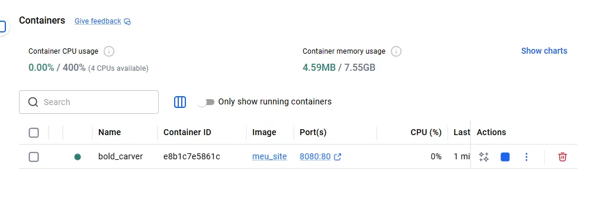
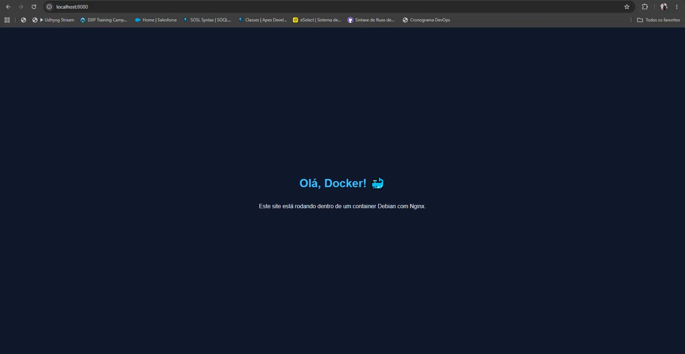

# Projeto Docker: Site com Debian e Nginx

Site estático servido por Nginx dentro de um container Debian (trixie).

## Como executar

    docker build -t meu_site .
    docker run -d -p 8080:80 meu_site

Depois, acesse http://localhost:8080

## Evidências

### Terminal: criação do .tar, build, run e docker ps

### Imagem criada no Docker Desktop

### Container em execução

### Site rodando no navegador
